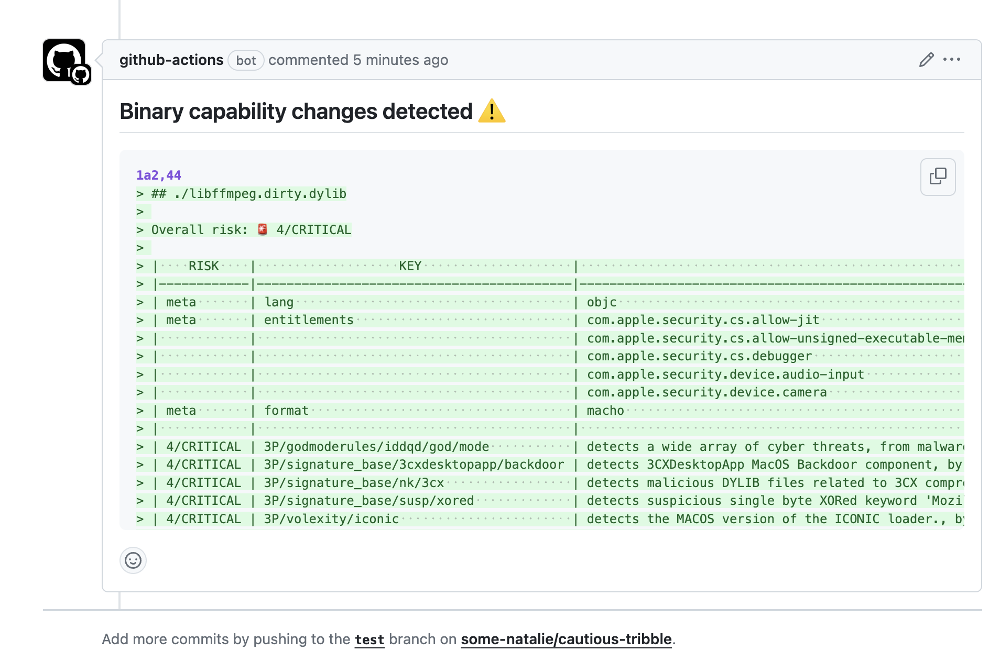
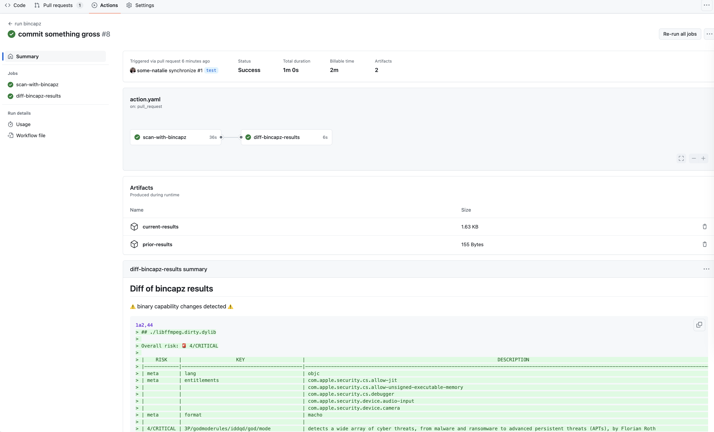

# bincapz-action

Enumerate and diff [capabilities](https://man7.org/linux/man-pages/man7/capabilities.7.html) of all files in a repository (and compiled artifacts)! 📦🔍

This action runs the [bincapz](https://github.com/chainguard-dev/bincapz) tool from [Chainguard](https://chainguard.dev) on a repository.  It can run as a PR check or to upload a release artifact.

- [example workflows](examples)
- [example reports](output-samples)

## pull request changes

For compiled languages, you'll need to do two steps in a workflow.

1. Check out the code at head and base, then build the two and run bincapz on the resulting binaries (if needed).  The workflow below is an example of that.
1. Compare the two reports from bincapz.

[example github actions file](examples/pr-check.yml)

### comment on the PR

here's an example of adding it as a PR comment

```yaml
      - name: Diff bincapz results
        shell: bash
        run: |
          if [ $(diff prior-results/report.md current-results/report.md > diff.patch ) == "0" ]; then
            echo "✅ no binary capability changes detected" >> $GITHUB_EVENT_PATH
            echo "✅ no binary capability changes detected" >> diff.patch
            exit 0
          else
            echo "⚠️ binary capability changes detected ⚠️" >> $GITHUB_EVENT_PATH
            exit 0
          fi
      - name: Add github step summary to a PR comment
        uses: actions/github-script@v7
        with:
          github-token: ${{ github.token }}
          script: |
            const fs = require('fs');
            const diff = fs.readFileSync('diff.patch', 'utf8');
            github.rest.issues.createComment({
                issue_number: context.issue.number,
                owner: context.repo.owner,
                repo: context.repo.repo,
                body: '## Binary capability changes detected ⚠️\n\n```diff\n' + diff + '\n```'
              })
```



### add a step summary

here's an example of adding it as a summary

```yaml
      - name: Diff bincapz results
        shell: bash
        run: |
          echo "## Diff of bincapz results" >> $GITHUB_STEP_SUMMARY
          echo ' ' >> $GITHUB_STEP_SUMMARY
          if [ $(diff prior-results/report.md current-results/report.md > diff.patch ) == "0" ]; then
            echo "✅ no binary capability changes detected" >> $GITHUB_STEP_SUMMARY
            exit 0
          else
            echo "⚠️ binary capability changes detected ⚠️" >> $GITHUB_STEP_SUMMARY
            echo '```diff' >> $GITHUB_STEP_SUMMARY
            cat diff.patch >> $GITHUB_STEP_SUMMARY
            echo '```' >> $GITHUB_STEP_SUMMARY
            exit 0
          fi
```


